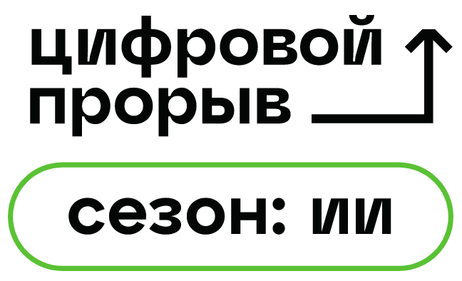
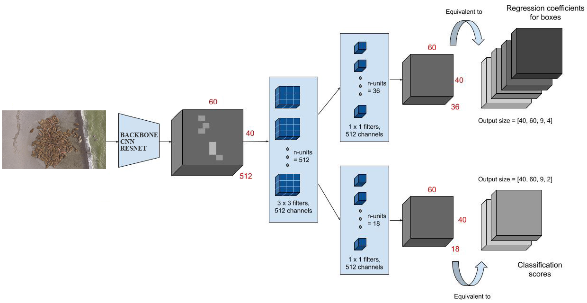
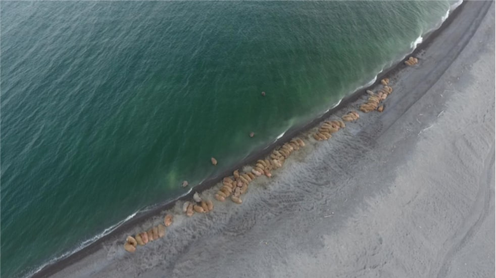
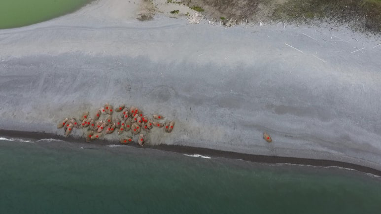
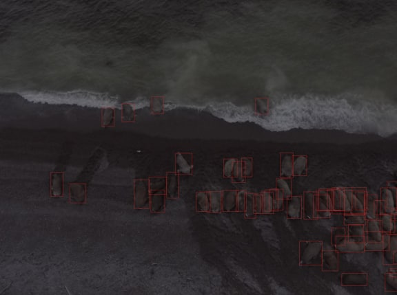

# Bosphorus. Цифровой прорыв. Кейс: ИИ на страже ненецких моржей
<h1 align="center">
  
</h1>

## Описание решения
MVP приложения, использующее обученную нейронную сеть. Для удобства работы с моделью было реализовано оконное приложение, позволяющее в несколько кликов осущесвить анализ фотографии, и предоставить как общее число моржей, так и их координаты на снимке.

Архитектура модели выглядит следующим образом
<h1 align="center">
  
</h1>

## Программа и веса модели находятся по следующей ссылке:
```
https://drive.google.com/drive/folders/1b1l6L8UrpDvvry4DWvs8KVIUZ5TQVpHx?usp=sharing
```

## Участники команды
 - Спицин Артем
 - Ли Павел
 - Колот Юрий
 - Маношин Дмитрий
 - Ганеев Рашид

## Ключевые особенности
 - Обученная эффективная нейронная сеть
 - Отсутствие необходимости подключения к интернету
 - Быстрое распознавание, обработка ```4k``` фото = ```6``` секунд
 - Оконное приложение, позволяющее легко производить работу с нейронной сетью
 - Возможность распознавания в ночное время суток

## Пример работы пайплайна для одной фотографии
### Дневные фото
-----------------



### Работа в темное время суток
-----------------
